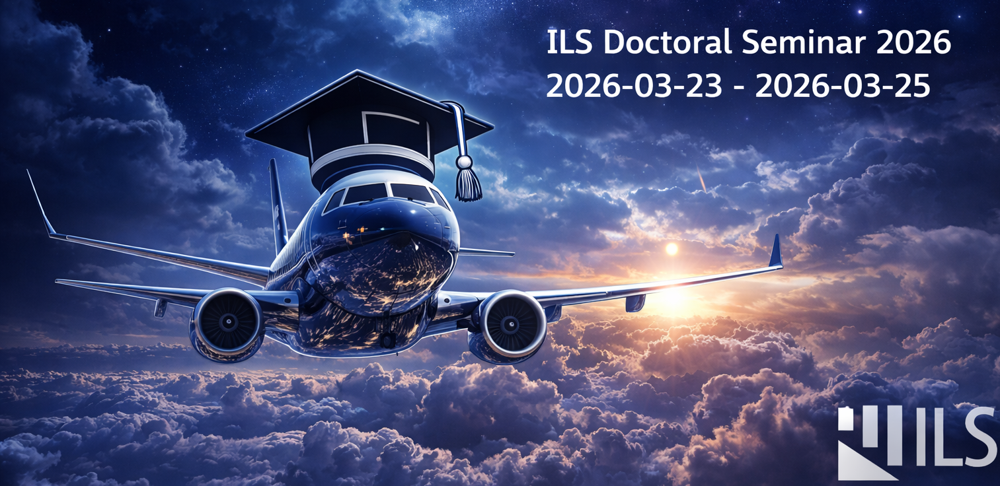

---
# Feel free to add content and custom Front Matter to this file.
# To modify the layout, see https://jekyllrb.com/docs/themes/#overriding-theme-defaults

layout: page
title: Doctoral Seminar 2026
permalink: /seminar-2026/
---

<strong>Upcoming important dates</strong> 
Presentation submission deadline: 2026-03-20 2:00 PM.

It is our great pleasure to welcome you to the ILS Doctoral Seminar 2026, organized by the Institute of Aircraft Systems (ILS) at the University of Stuttgart.

The doctoral seminar provides a dedicated forum for doctoral researchers to present their work, exchange ideas, and foster collaboration in the field of aircraft and aeronautical systems. Over the course of the seminar, participants will have the opportunity to discuss current research results, methodological advances, and emerging challenges, while strengthening scientific exchange and networking within ILS.

Building on the success of previous editions [ILS Doctoral Seminar 2025](/seminar-2025/), the 2026 seminar is designed to encourage open dialogue and in-depth discussion across research areas. The sessions will cover a broad range of topics shaping the future of aircraft systems, including avionics architectures, system development and verification methods, certification approaches, particularly in the context of artificial intelligence, and supporting tools and methodologies for safety-critical systems.

This seminar is intended as a collaborative platform, where ideas can be challenged, perspectives broadened, and new connections established. Beyond presenting individual research contributions, we aim to create an environment that promotes constructive feedback, interdisciplinary exchange, and long-term cooperation among ILS researchers.

The seminar will be held in English. All participants are invited to contribute by submitting a one-page abstract and giving a presentation on their research work. Detailed information regarding submission requirements and presentation guidelines can be found in the [Author Instructions](/seminar-2026/instructions/).

We look forward to welcoming you and to the stimulating discussions and fruitful exchanges that will make the ILS Doctoral Seminar 2026 a rewarding experience for all participants.
